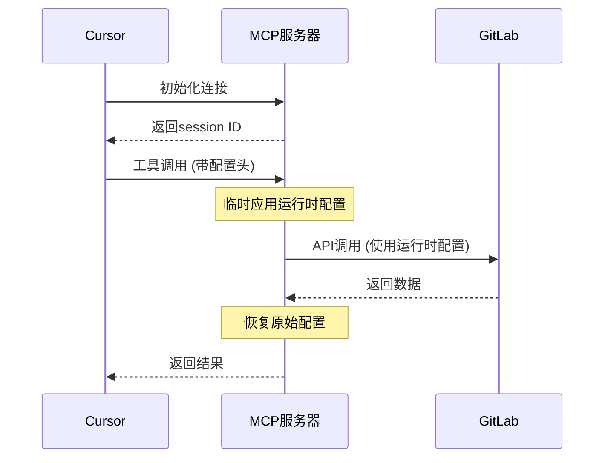

# 👥 使用者指南 - 配置说明

> **📖 面向对象**：需要配置GitLab MCP服务器的用户
>
> 本文档介绍项目的环境变量配置和参数说明。

## 环境变量配置

项目通过环境变量进行配置，支持多级配置源（默认 → 环境变量 → 运行时配置）：

### 环境变量表格

| 变量名 | 类型 | 默认值 | 必需 | 描述 |
|--------|------|--------|------|------|
| `GITLAB_URL` | string | `https://gitlab.com/` | 否 | GitLab 实例地址，支持自建实例 |
| `GITLAB_TOKEN` | string | - | 是 | GitLab 个人访问令牌，需具备 `read_api` 权限 |
| `PORT` | number | `3000` | 否 | HTTP 服务器监听端口（仅HTTP模式使用） |
| `GITLAB_FETCH_CONCURRENCY` | number | `8` | 否 | 并发抓取分支的并发度，避免API限流 |

### 基本配置示例

```bash
# 必需配置
export GITLAB_TOKEN=glpat_xxx

# 可选配置
export GITLAB_URL=https://gitlab.com/
export PORT=3000
export GITLAB_FETCH_CONCURRENCY=4
```

### 获取GitLab令牌

1. 登录 GitLab 实例
2. 进入 **Settings** → **Access Tokens**
3. 创建新的 Personal Access Token
4. 勾选 `read_api` 权限（必需）
5. 可选勾选其他权限以扩展功能：
   - `read_repository` - 读取仓库信息
   - `read_user` - 读取用户信息

**安全提示**：令牌具有敏感性，请妥善保管，避免在代码中硬编码。

## GitLab API 限制和最佳实践

### API 速率限制

GitLab API 实施速率限制以确保服务稳定性：

| API 类型 | 限制 | 时间窗口 | 说明 |
|----------|------|----------|------|
| 认证请求 | 10 次/分钟 | 1分钟 | 登录、令牌验证等 |
| 一般 API | 2000 次/小时 | 1小时 | 大多数读取操作 |
| 项目列表 | 1000 次/小时 | 1小时 | `/api/v4/projects` 端点 |
| 搜索 API | 30 次/分钟 | 1分钟 | 搜索相关操作 |

### 优化建议

#### 1. 并发控制
```bash
# 降低并发度以减少API限流风险
export GITLAB_FETCH_CONCURRENCY=4
```

#### 2. 分页处理
- 项目列表默认返回前100个项目
- 如需更多项目，可调整 `per_page` 参数（最大100）
- 使用 `order_by` 和 `sort` 优化查询性能

#### 3. 缓存策略
- 考虑对频繁访问的数据实施客户端缓存
- 缓存有效期建议：项目列表 5-10分钟，分支信息 1-2分钟

### 常见错误处理

#### 401 Unauthorized（认证失败）
```
❌ 获取GitLab项目失败 (状态码: 401): {"message":"401 Unauthorized"}

💡 认证失败提示:
1. 检查GITLAB_TOKEN是否正确
2. 确认令牌具有read_api权限
3. 检查令牌是否已过期
4. 访问GitLab > Settings > Access Tokens 重新生成令牌
```

#### 403 Forbidden（权限不足）
```
❌ 获取GitLab项目失败 (状态码: 403): {"message":"403 Forbidden"}

💡 权限不足提示:
1. 确认令牌具有足够的权限
2. 检查用户是否有访问项目的权限
3. 联系GitLab管理员确认权限设置
```

#### 429 Too Many Requests（请求过于频繁）
```
❌ 获取GitLab项目失败 (状态码: 429): {"message":"429 Too Many Requests"}

💡 API限流提示:
1. 降低 GITLAB_FETCH_CONCURRENCY 值
2. 增加请求间隔时间
3. 检查是否触发了GitLab的速率限制
```

### 网络和连接优化

#### 自签名证书环境
```bash
# 对于自签名证书的环境
export NODE_TLS_REJECT_UNAUTHORIZED=0  # 仅用于测试环境
```

#### 代理配置
```bash
export HTTP_PROXY=http://proxy.company.com:8080
export HTTPS_PROXY=http://proxy.company.com:8080
```

#### 超时设置
- 默认超时时间：30秒
- 对于慢速网络，可适当增加超时时间
- 建议不要设置过长的超时以避免资源浪费

## 常见配置场景

### 企业内网 GitLab
```bash
export GITLAB_URL=https://gitlab.internal.company.com/
export GITLAB_TOKEN=glpat_xxx
export PORT=3000
```

### 通过代理访问
```bash
export HTTP_PROXY=http://proxy.company.com:8080
export HTTPS_PROXY=http://proxy.company.com:8080
export GITLAB_URL=https://gitlab.com/
export GITLAB_TOKEN=your_token_here
```

### 自签名证书环境
```bash
export GITLAB_URL=https://self-signed.gitlab.com/
export GITLAB_TOKEN=glpat_xxx
export NODE_TLS_REJECT_UNAUTHORIZED=0  # 仅用于测试环境
```

### 高并发优化
```bash
export GITLAB_FETCH_CONCURRENCY=2  # 降低并发避免限流
export PORT=3000
```

## 🚀 运行时动态配置

除了传统的环境变量配置外，项目还支持运行时动态配置，允许在不重启服务器的情况下动态切换GitLab实例。

### 核心特性

- ✅ **启动时无需配置**：服务器启动时不需要设置GITLAB_TOKEN
- ✅ **运行时动态切换**：每次工具调用时通过HTTP头传递配置
- ✅ **多实例支持**：同时使用多个GitLab实例
- ✅ **会话隔离**：不同会话可以使用不同的配置

### Cursor配置

```json
{
  "mcpServers": {
    "gitlab-dynamic": {
      "transport": "http",
      "url": "http://localhost:3000/mcp",
      "env": {}
    }
  }
}
```

### 使用方式

#### 1. 启动服务器
```bash
# 无需设置环境变量
yarn http:dev
```

#### 2. HTTP请求传递配置
```bash
# 初始化连接
curl -X POST http://localhost:3000/mcp \
  -H "Content-Type: application/json" \
  -d '{
    "jsonrpc": "2.0",
    "id": 1,
    "method": "initialize",
    "params": {
      "protocolVersion": "2024-11-05",
      "capabilities": {"tools": {}},
      "clientInfo": {"name": "test-client", "version": "1.0.0"}
    }
  }'

# 调用工具（带配置）
curl -X POST http://localhost:3000/mcp \
  -H "mcp-session-id: YOUR_SESSION_ID" \
  -H "X-GitLab-URL: https://gitlab.company.com" \
  -H "X-GitLab-Token: your-token" \
  -d '{
    "jsonrpc": "2.0",
    "id": 2,
    "method": "tools/call",
    "params": {"name": "list_projects"}
  }'
```

### 配置传递方式

支持三种HTTP头传递配置的方式：

1. **X-GitLab-URL**: GitLab实例URL
2. **X-GitLab-Token**: GitLab访问令牌
3. **mcp-session-id**: 会话ID（自动生成）

### 工作流程



### 安全性说明

- 配置只在内存中临时使用，不持久化存储
- 每个请求独立配置，互不影响
- 请求完成后自动清理配置
- 支持会话级别的配置隔离

### 适用场景

- 需要频繁切换不同GitLab实例的开发环境
- 多租户应用，每个用户使用不同的GitLab实例
- CI/CD环境中动态配置GitLab连接
- 需要在运行时根据条件选择GitLab实例的场景


