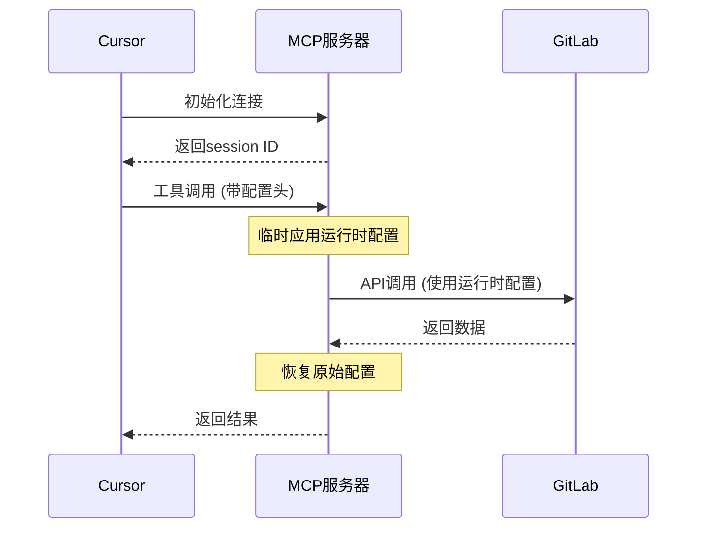

# 👥 使用者指南 - 配置说明

> **📖 面向对象**：需要配置GitLab MCP服务器的用户
>
> 本文档介绍项目的环境变量配置和参数说明。

项目通过环境变量进行配置：

- `GITLAB_URL`：GitLab 实例地址，默认 `https://gitlab.com/`
- `GITLAB_TOKEN`：GitLab 访问令牌（必须，需 `read_api` 权限）
- `PORT`：HTTP 服务器端口，默认 `3000`
 - `GITLAB_FETCH_CONCURRENCY`：并发抓取分支的并发度，默认 `8`

示例：

```bash
export GITLAB_TOKEN=glpat_xxx
export GITLAB_URL=https://gitlab.com/
export PORT=3000
export GITLAB_FETCH_CONCURRENCY=4 # 可选：降低并发以减小限流风险
```

提示：令牌可在 GitLab → Settings → Access Tokens 创建，勾选 `read_api`。

## 常见配置场景

### 企业内网 GitLab
```bash
export GITLAB_URL=https://gitlab.internal.company.com/
export GITLAB_TOKEN=glpat_xxx
export PORT=3000
```

### 通过代理访问
```bash
export HTTP_PROXY=http://proxy.company.com:8080
export HTTPS_PROXY=http://proxy.company.com:8080
export GITLAB_URL=https://gitlab.com/
export GITLAB_TOKEN=your_token_here
```

### 自签名证书环境
```bash
export GITLAB_URL=https://self-signed.gitlab.com/
export GITLAB_TOKEN=glpat_xxx
export NODE_TLS_REJECT_UNAUTHORIZED=0  # 仅用于测试环境
```

### 高并发优化
```bash
export GITLAB_FETCH_CONCURRENCY=2  # 降低并发避免限流
export PORT=3000
```

## 🚀 运行时动态配置

除了传统的环境变量配置外，项目还支持运行时动态配置，允许在不重启服务器的情况下动态切换GitLab实例。

### 核心特性

- ✅ **启动时无需配置**：服务器启动时不需要设置GITLAB_TOKEN
- ✅ **运行时动态切换**：每次工具调用时通过HTTP头传递配置
- ✅ **多实例支持**：同时使用多个GitLab实例
- ✅ **会话隔离**：不同会话可以使用不同的配置

### Cursor配置

```json
{
  "mcpServers": {
    "gitlab-dynamic": {
      "transport": "http",
      "url": "http://localhost:3000/mcp",
      "env": {}
    }
  }
}
```

### 使用方式

#### 1. 启动服务器
```bash
# 无需设置环境变量
yarn http:dev
```

#### 2. HTTP请求传递配置
```bash
# 初始化连接
curl -X POST http://localhost:3000/mcp \
  -H "Content-Type: application/json" \
  -d '{
    "jsonrpc": "2.0",
    "id": 1,
    "method": "initialize",
    "params": {
      "protocolVersion": "2024-11-05",
      "capabilities": {"tools": {}},
      "clientInfo": {"name": "test-client", "version": "1.0.0"}
    }
  }'

# 调用工具（带配置）
curl -X POST http://localhost:3000/mcp \
  -H "mcp-session-id: YOUR_SESSION_ID" \
  -H "X-GitLab-URL: https://gitlab.company.com" \
  -H "X-GitLab-Token: your-token" \
  -d '{
    "jsonrpc": "2.0",
    "id": 2,
    "method": "tools/call",
    "params": {"name": "list_projects"}
  }'
```

### 配置传递方式

支持三种HTTP头传递配置的方式：

1. **X-GitLab-URL**: GitLab实例URL
2. **X-GitLab-Token**: GitLab访问令牌
3. **mcp-session-id**: 会话ID（自动生成）

### 工作流程



### 安全性说明

- 配置只在内存中临时使用，不持久化存储
- 每个请求独立配置，互不影响
- 请求完成后自动清理配置
- 支持会话级别的配置隔离

### 适用场景

- 需要频繁切换不同GitLab实例的开发环境
- 多租户应用，每个用户使用不同的GitLab实例
- CI/CD环境中动态配置GitLab连接
- 需要在运行时根据条件选择GitLab实例的场景


